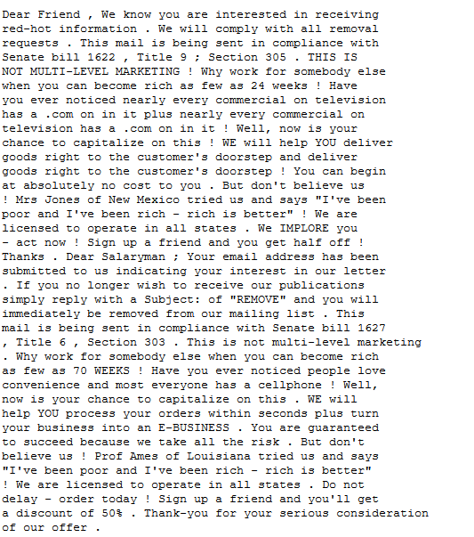

# BITSCTF_DFIR
## Таск 1 - Intro to DFIR
### Текст таска: 
DFIR or Digital Forensics and Incident Response is a field within cybersecurity that focuses on the identification, investigation, and remediation of cyberattacks. Here are the types of analysis you can expect throughout these sequence of challenges!

### Решение:
В этом таске создатели выдали нам дамп памяти формата mem, образ диска формата AD1 для FTK, и Pcap 

### Флаг: 
`BITSCTF{DFIR_r0ck55}`

## Таск 2 - Access Granted!
### Текст таска: 
First things first. MogamBro is so dumb that he might be using the same set of passwords everywhere, so lets try cracking his PC's password for some luck.

### Решение:
Первое что мне пришло в голову - проверить дамп памяти, используя плагин hashdump в volatility.
Поскольку определение профиля в vol2 не увенчалось успехом, я решил использовать vol3

Дальше все просто, закидываем хеш на crackstation, и получаем флаг.
### Флаг: 
Оставлять его не буду, но скажу, что осуждаю его содержание

## Таск 3 - 0.69 Day
### Текст таска: 
MogamBro was using some really old piece of software for his daily tasks. What a noob! Doesn't he know that using these deprecated versions of the same leaves him vulnerable towards various attacks! Sure he faced the consequences through those spam mails. Can you figure out the CVE of the exploit that the attacker used to gain access to MogamBro's machine & play around with his stuff.

### Решение:
Посмотреть содержимое диска машины в нашем случае проще всего, непосредтсвенно при помощи образа диска AD1.
Откроем его в FTK.
После небольших поисков обнаружились подозрительные файлы. Письмо, крайне подозриетльного содержания, и, судя по всему файлы, которые были загружены по ссылкам из этого письма.

Смотрим на архив - и замечаем что-то необычное.

Внутри архива находится папка и файл. С идентичными названиями и расширениями, что наврятле может быть сделано ненамеренно.

Погуглим.

Сразу натыкаемся на CVE-2023-38831.

https://www.uptycs.com/blog/cve-2023-38831-winrar-zero-day

(дополнительно приложу [PoC](https://github.com/HDCE-inc/CVE-2023-38831), найденный на просторах github)

Исходя из описания CVE - это наша история. Вводим флаг - все сходится, мы великолепны.

### Флаг: 
`BITSCTF{CVE-2023-38831}`

## Таск 4 - I'm wired in
### Текст таска: 
MogamBro got scared after knowing that his PC has been hacked and tried to type a SOS message to his friend through his 'keyboard'. Can you find the contents of that message, obviously the attacker was logging him!

### Решение: 
В таске упоминались клавиатуры и логирование чего-то. Ну очень жирный намек на кейлогер.
Покопаемся в AD1.

Натыкаемся на pcapng с красноречивым названием. Думаю комментарии тут излишни.

Наблюдаем здесь большое количество, на первый взгляд, совсем непонятных пакетов.
Чисто логически, можно рассудить, что вначале происходит какого-то рода установка соединения.
Далее - передача данных. 
Внутри пакетов данных, адресованных хосту, передается HID data, что, скорее всего, является данными ввода с клавиатуры.
Осталось вытащить их, и понять, как их расшифровать.

Отфильтруем кадры по адресу назначения и размеру кадра, и добавим поле HID data как колонку
`usb.dst == host and frame.len == 35

Затем экспортим фильтрованые кадры в формате pacpng

Воспользуемся отличным инструментом для расшифровки HID даты - [PUK](https://github.com/syminical/PUK).
Для начала подготовим для него input

И закинем его в PUK

### Флаг: 
`BITSCTF{I_7h1nk_th3y_4Re_k3yl0991ng_ME!}`

## Таск 5 - Lottery
### Текст таска: 
Now that you know the CVE, figure out how the attacker crafted the payload & executed it to compromise the 'secret'.

### Решение: 
В тексте таска говорится о неком секрете "secret", который был скомпрометирован. 
Поищем его, потом будем думать дальше.

Находим его зашифрованым, в директории Downloads, вместе с lottery.exe, и архивом follow-these-instructions, который мы уже видели в 3 таске. 

Посмотрим на содержимое архива поближе. 
Исходя из команды батника можно заключить, что он ответственен за развертку вредоноса, зип файл с CVE-2023-38831 был лишь способом доставки для lottery.exe, который, судя по всему является шфировальщиком, пошифровавшим secret.png.enc

Экспортнем шифровальщик и зальем его на вирустотал.

Видим, что пакер у нас - pyinstaller, было бы неплохо распаковать все это дело. 
Немного поискав я наткнулся на [эту](https://github.com/extremecoders-re/pyinstxtractor) тулзу

Сразу же, задыхаясь от жадности, установил цепкими лапами, и заюзал мегадевайс.

Посмотрим, что нам надекомпелировало

Покопавшись, натыкаемся на lottery.pyc

Он скомпелирован, поэтому надо его декомпелировать. Воспользуемся [этой](https://pypi.org/project/uncompyle6/) тулзой, найденной на просторах интернетов.

Откроем декомпилированый файл

Судя по тому что в нем содержится, шифровался secret при помощи AES, вектором инициализации являлась фраза urfuckedmogambro, а ключ был временным файлом длинной 32 байта. 

Осталось попробовать найти ключ и дешифровать все это дело

Залазим в `C:\Users\MogamBro\AppData\Local\Temp\`, и наблюдаем кучу файлов, но длинной 32 байта там 1.

Самое время закинуть все в кибершефа

Дешифруем картинку и получаем флаг
### Флаг: 
`BITSCTF{1_r3c3ived_7h3_b0mbz}`

## Таск 6 - ## Bypassing Transport Layer
### Текст таска: 
The exploit not only manipulated MogamBro's secret but also tried to establish an external TCP connection to gain further access to the machine. But I don't really think he was able to do so. Can you figure out where the exploit was trying to reach to?

### Решение: 
Исходя из названия таска, стоит покопаться в Pcap'e. 

В pcap'e видно http2, а это означает что все пошифровано, надо-бы достать ключи шифрования.

А вот и они, там же где и кейлог.

Импортируем ключи в wireshark 

Теперь мы можем просматривать http2

Остался главный вопрос - как и что искать? 
Как мы помним - в прошлом таске упоминался pastebin. Поищем по нему.

Экспортнем обьекты, чтобы навести порядка

Видим текст/css, поехали смотерть что там

В контенте первого же файла - mPvzn0AD.txt содержится флаг

### Флаг: 
`BITSCTF{5te4l1ng_pr1v47e_key5_ez:)}`

## Таск 7 - MogamBro's guilty pleasure
### Текст таска: 
MogamBro was spammed with a lot of emails, he was able to evade some but fell for some of them due to his greed. Can you analyze the emails & figure out how he got scammed, not once but twice!
### Решение: 
В таске говорилось о письмах, так что первое с чего стоит начать - проверить файлы outlook

Наблюдаем 2 письма, притом достаточно подозрительного содержания

В первом письме мы можем наблюдать спам текст:

А во втором - ссылки на вредонос и архив из предыдущих тасков, так что сфокусируемся на 1ом.

После достаточно долгих поисков информации о стеганографии в спаме - натыкаюсь на упоминание некоего SpamMimic

Гуглим, и натыкаемся на их сайт. Вводим текст, и получаем флаг.

### Флаг: 
`BITSCTF{sp4m_2_ph1sh_U}`
